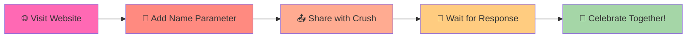

# 💖 Interactive Love Proposal Website

<div align="center">


[](https://vanshcz.github.io/itstruelove)

<br>

[](https://vanshcz.github.io/itstruelove)
[](https://github.com/vanshcz/itstruelove)
[](https://vanshcz.online)

<br>

[](https://github.com/vanshcz/itstruelove/stargazers)
[](https://github.com/vanshcz/itstruelove/network/members)
[](https://github.com/vanshcz/itstruelove/watchers)


</div>

---

<div align="center">

## 🎬 Preview


<br><br>

> *A romantic and interactive proposal website designed to create unforgettable moments.*  
> *With playful animations, personalized messages, and a touch of magic!* ✨

</div>

---

## 🌟 Try It Now!

<div align="center">

### 👇 Click to Experience the Magic 👇

<a href="https://vanshcz.github.io/itstruelove">
  
</a>

<br><br>

### 🎁 Personalize for Your Loved One

```
https://vanshcz.github.io/itstruelove?name=YourCrushName
```

<a href="https://vanshcz.github.io/itstruelove?name=MyLove">
  
</a>

</div>

---

## ✨ Features

<div align="center">

| Feature | Description |
|:---:|:---|
| 💌 | **Personalized Messages** - Add your special someone's name through the URL |
| 🎉 | **Confetti Celebration** - Beautiful confetti animation when they say "Yes" |
| 🎮 | **Lottie Animations** - Smooth and engaging heart animations |
| 🔹 | **Playful "No" Button** - The "No" button moves randomly (can't escape love!) |
| 📱 | **Fully Responsive** - Works on all devices seamlessly |
| 🎨 | **Beautiful UI** - Gradient backgrounds and modern design |
| ⚡ | **Fast Loading** - Optimized for quick performance |
| 🔗 | **Easy Sharing** - Simple URL-based customization |

</div>

<details>
<summary><b>📸 Feature Screenshots</b></summary>
<br>

<div align="center">

### 💕 Main Screen


### 🎊 Success Animation


### 😅 Playful No Button


</div>

</details>

---

## 🚀 Quick Start

<div align="center">



</div>

### 📋 Step-by-Step Guide

```bash
# Step 1: Visit the website
https://vanshcz.github.io/itstruelove

# Step 2: Add your crush's name
https://vanshcz.github.io/itstruelove?name=Jessica

# Step 3: Share the link with your special someone! 💝
```

---

## 🧐 Customization Guide

<details>
<summary><b>🎨 1. Change Colors</b></summary>

Edit the CSS variables in `style.css`:
```css
:root {
  --primary-color: #e91e63;      /* 💗 Main pink color */
  --secondary-color: #ff4081;    /* 💕 Secondary accent */
  --background-color: #ffe5e5;   /* 🌸 Page background */
  --text-color: #333333;         /* 📝 Text color */
  --button-hover: #c2185b;       /* 🔘 Button hover */
}
```

</details>

<details>
<summary><b>✏️ 2. Change Text Content</b></summary>

Edit the content in `index.html`:
```html
<!-- Main Heading -->
<h1>Hey <span id="name-placeholder"></span>! 💖</h1>

<!-- Proposal Question -->
<p class="proposal-text">Will you make me the happiest person in the world?</p>

<!-- Button Text -->
<button class="yes-btn">Yes, I will! 💕</button>
<button class="no-btn">Let me think... 🤔</button>
```

</details>

<details>
<summary><b>🎬 3. Update Animations</b></summary>

Replace the Lottie JSON files:
1. Get new animations from [LottieFiles](https://lottiefiles.com/)
2. Replace the existing `sticker*.json` files
3. Update references in `script.js`:

```javascript
// Load custom animation
const animation = lottie.loadAnimation({
  container: document.getElementById('lottie-container'),
  renderer: 'svg',
  loop: true,
  autoplay: true,
  path: 'your-animation.json'  // 👈 Change this
});
```

</details>

<details>
<summary><b>🎊 4. Customize Confetti</b></summary>

Modify confetti settings in `script.js`:
```javascript
confetti({
  particleCount: 150,        // 🔢 Number of confetti
  spread: 80,                // 📐 Spread angle
  origin: { y: 0.6 },        // 📍 Origin point
  colors: ['#ff69b4', '#ff1493', '#ff6b6b', '#ffd700']  // 🎨 Colors
});
```

</details>

---

## 🌐 Technologies Used

<div align="center">

### 🛠️ Tech Stack


### 📚 Libraries


### ☁️ Hosting


</div>

---

## 📁 Project Structure

```
itstruelove/
├── 📄 index.html          # Main HTML file
├── 🎨 style.css           # Styling and animations
├── ⚡ script.js           # Interactive functionality
├── 🎬 sticker1.json       # Lottie animation file
├── 🎬 sticker2.json       # Lottie animation file
├── 🖼️ preview.gif         # Preview image
├── 📜 LICENSE             # MIT License
└── 📖 README.md           # Documentation
```

---

## 🤝 Contributing

<div align="center">

Contributions make the open-source community amazing! 🌟

</div>

```bash
# 1. Fork the repository
# 2. Create your feature branch
git checkout -b feature/AmazingFeature

# 3. Commit your changes
git commit -m '✨ Add some AmazingFeature'

# 4. Push to the branch
git push origin feature/AmazingFeature

# 5. Open a Pull Request
```

<div align="center">

[](https://github.com/vanshcz/itstruelove/issues)

</div>

---

## 📜 License

<div align="center">

This project is licensed under the **MIT License**

[](https://opensource.org/licenses/MIT)

See the [LICENSE](https://github.com/vanshcz/itstruelove/blob/main/LICENSE) file for details.

</div>

---

## 📧 Contact & Support

<div align="center">

### 👨‍💻 Created by Vansh

[](https://vanshcz.online)
[](https://github.com/vanshcz)
[](https://t.me/botsarefather)

<br>

### 📬 Get in Touch

| Platform | Link |
|:---:|:---:|
| 🌐 Website | [vanshcz.online](https://vanshcz.online) |
| 📂 GitHub | [@vanshcz](https://github.com/vanshcz) |
| 📱 Telegram | [@botsarefather](https://t.me/botsarefather) |
| 📁 Project | [itstruelove](https://github.com/vanshcz/itstruelove) |

</div>

---

## 🙏 Credits

<div align="center">

| Credit | Description |
|:---:|:---|
| 💻 | **Created by** [Vansh](https://vanshcz.online) |
| 🎨 | **Animations** from [LottieFiles](https://lottiefiles.com) |
| 🎊 | **Confetti** by [Canvas Confetti](https://www.kirilv.com/canvas-confetti/) |
| 💡 | **Inspired by** the open-source community |

</div>

---

## ⭐ Show Your Support

<div align="center">

If you found this project helpful, please give it a star! ⭐

[](https://github.com/vanshcz/itstruelove)

### 💝 Share the Love!

```
https://vanshcz.github.io/itstruelove?name=YourSpecialPerson
```

<a href="https://vanshcz.github.io/itstruelove">
  
</a>

</div>

---

<div align="center">


### Made with ❤️ by [Vansh](https://vanshcz.online)

[](https://github.com/vanshcz/itstruelove)

**© 2024 [vanshcz.online](https://vanshcz.online) - All Rights Reserved**

</div>
